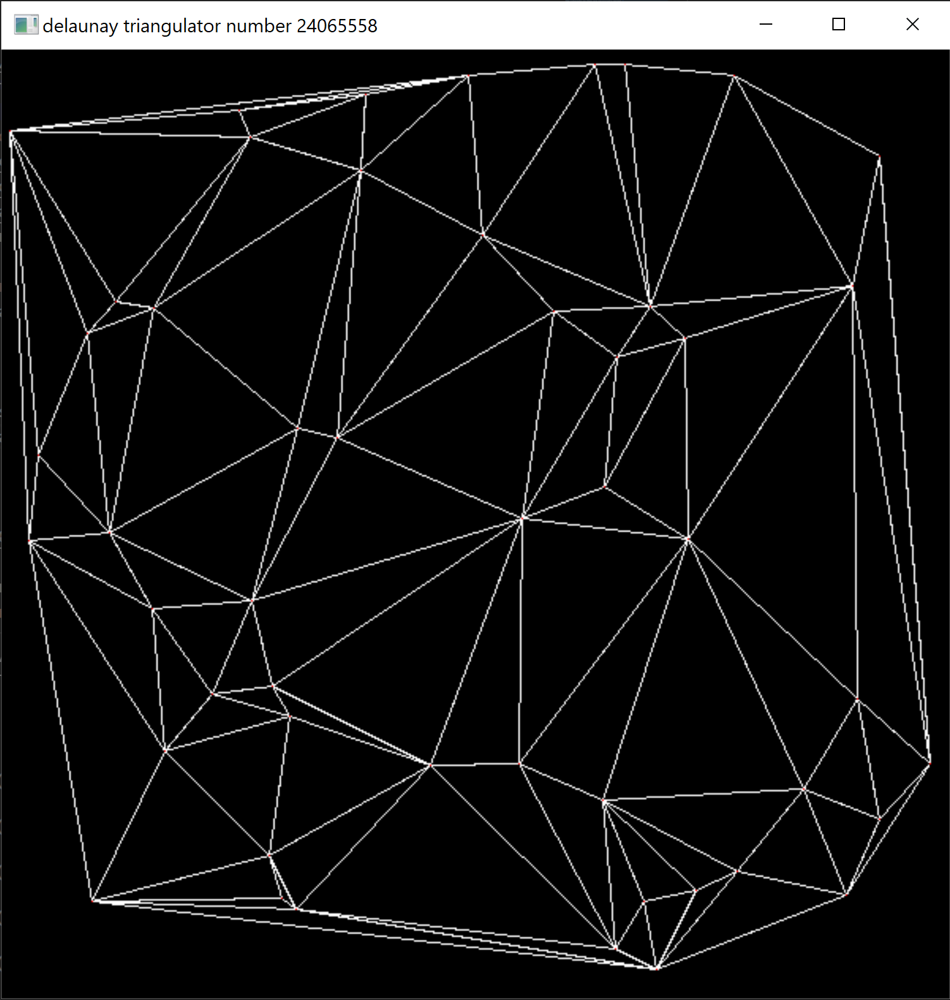
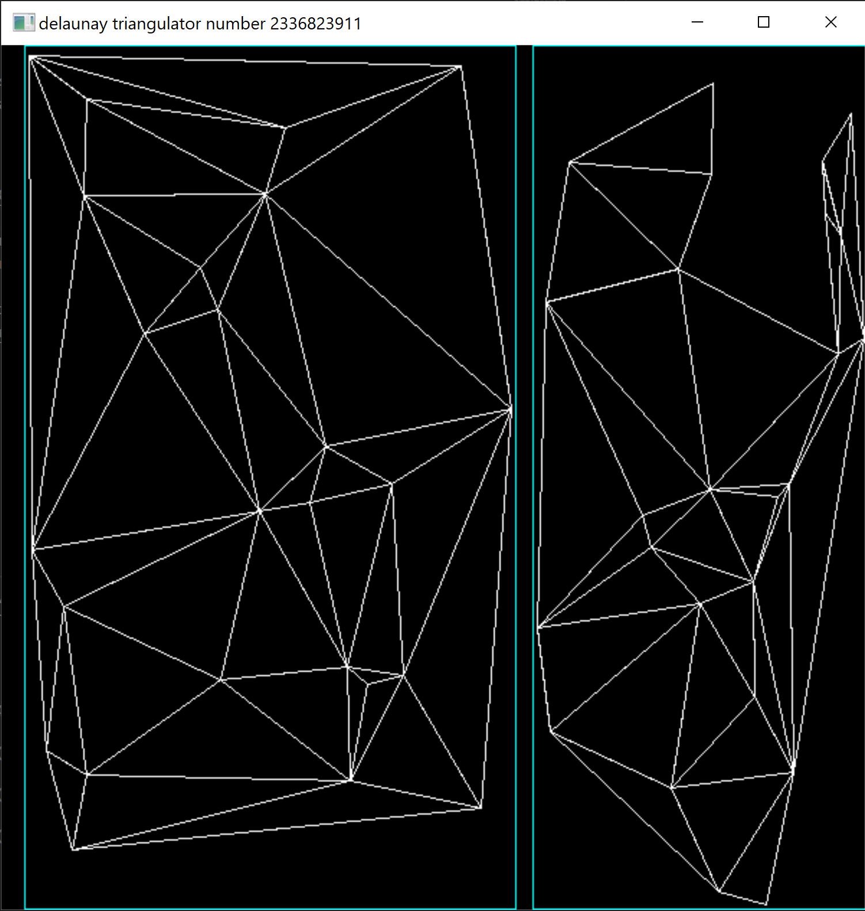

# delaunay-visualizer

A visualization of the divide and conquer approach to [Delaunay Triangulation](https://en.wikipedia.org/wiki/Delaunay_triangulation).
The algorithm used is the divide and conquer method presented by Guibas and Stolfi in their paper [Primitives for the Manipulation of General Subdivisions and the Computation of Voronoi Diagrams](https://www.researchgate.net/publication/221590183_Primitives_for_the_Manipulation_of_General_Subdivisions_and_the_Computation_of_Voronoi_Diagrams). It uses the quad edge data structure which allows for very easy and simple manipulation of graphs in the plane. If complex topology isn't your thing, check out Samuel Peterson's [Computing Constrained Delaunay Triangulations](http://www.geom.uiuc.edu/~samuelp/del_project.html) for a simpler explanation of the algorithm.

## Usage
By default the program will generate points randomly then triangulate them step by step. Use the spacebar to advance each step. The cyan boxes outline the subgraphs as they are recursively merged.

 | 
:---------------------------------------------------:|:--------------------------------------------------------:
A completed triangulation                            | A merge operation in progress


## Building
The visualization uses SDL2 which can be downloaded [here](https://www.libsdl.org/download-2.0.php).

Code has been tested on Windows 10 using mingw with the following flags:
```
--std=c++17 -ISDL2\\include -LSDL2\\lib -lmingw32 -lSDL2main -lSDL
```

More information on building SDL apps for other platforms can be found [here](https://wiki.libsdl.org/Installation).
